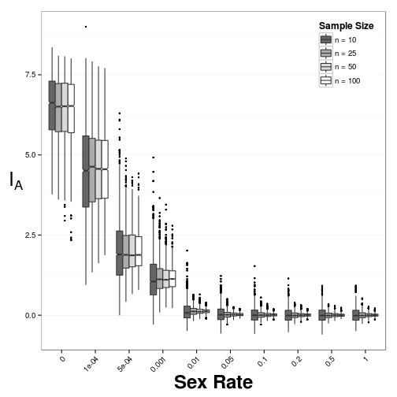
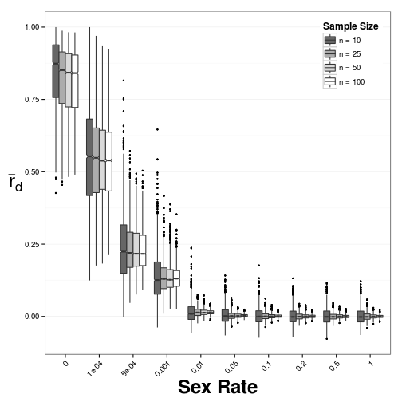
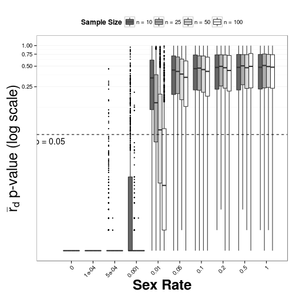
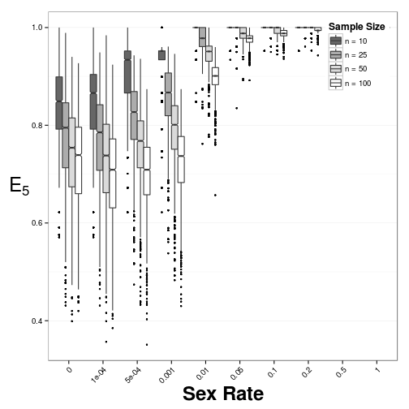
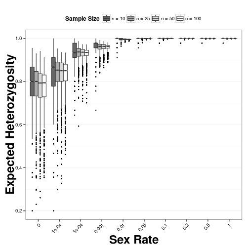
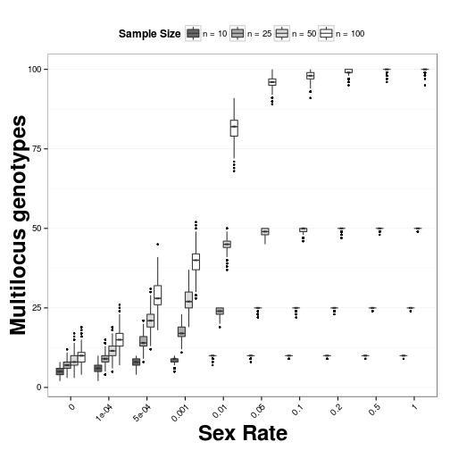
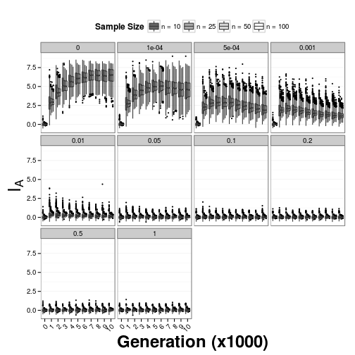
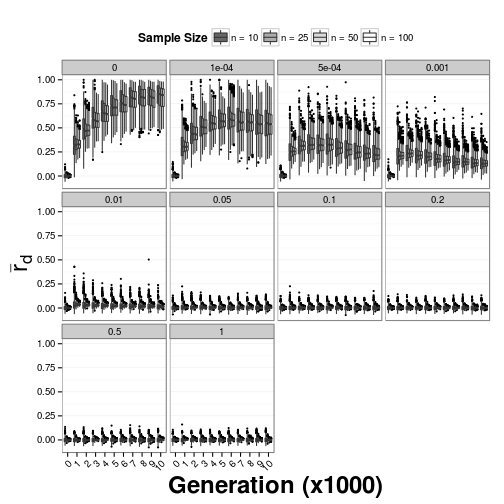
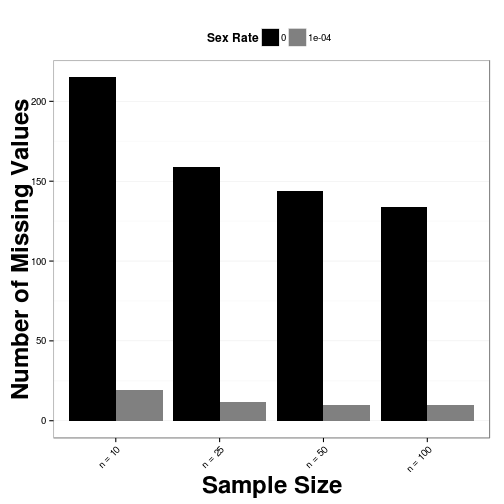
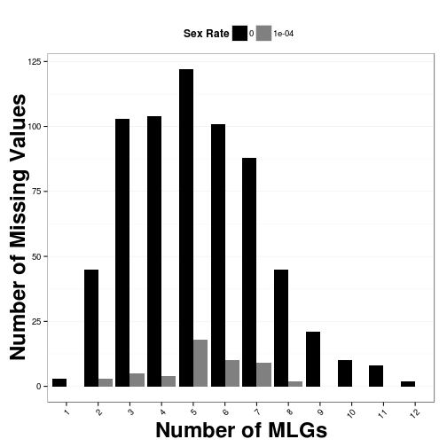

simulations and LD
========================================================
author: Zhian N. Kamvar
date: 2013-09-19
font-family: "Helvetica"

Simulation Parameters via Simupop v.1.0.8
========================================================

- Rates of sexual reproduction: **10**
- Number of Loci: **10**
- Alleles per Locus: **6 to 10**
- Populations per sex rate: **100**
- Mutation Rate: **$1 \times 10^{-5}$**

***

- Sample sizes: **100, 50, 25, 10**
- Samples per population: **40**
- Generations/individuals: **10,000**
- Total number of data sets: **40,000**

Index of Association Behavior
========================================================

 

***

 

P values
========================================================

 

***

 

Evenness and Nei 1978 Genotypic Div.
========================================================

 

***

 

G and MLG
========================================================

 

***

 

All Ia values
========================================================

 

All rbarD
========================================================

 

Missing values
========================================================

 

***

 

